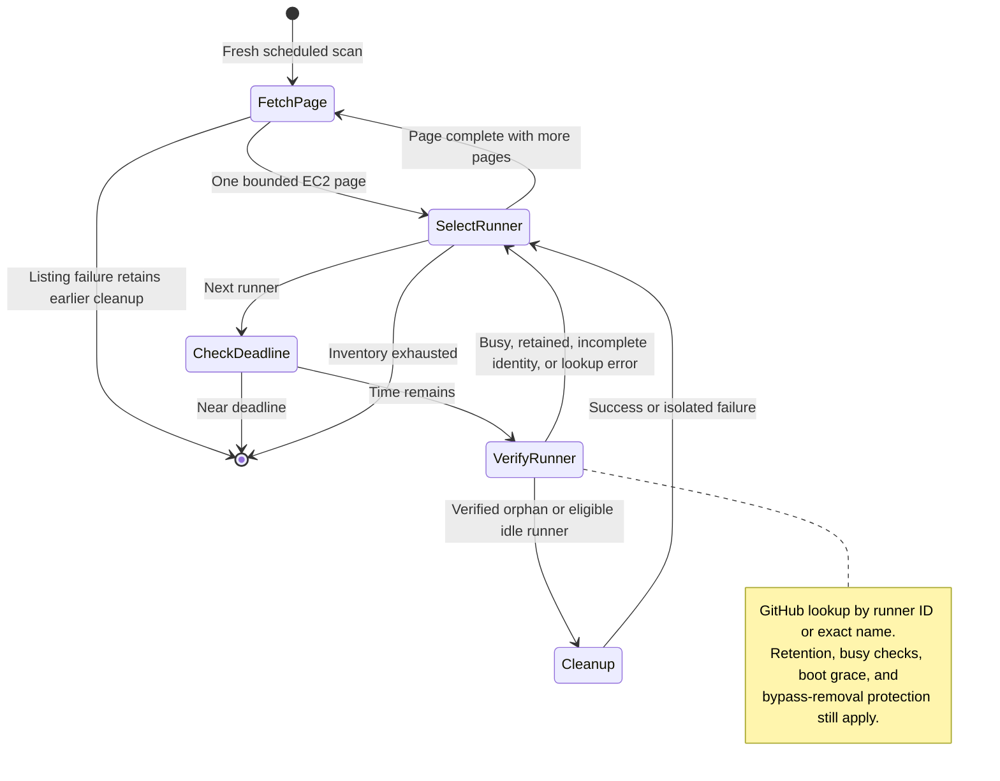

# GitHub Actions Runner Scale-Down State Diagram

<!-- --8<-- [start:mkdocs_scale_down_state_diagram] -->

Scale-down is stateless. Each invocation lists current EC2 inventory in bounded pages (ten instances per request) and processes orphaned and active runners from each page before requesting the next. It does not collect the entire fleet before cleanup. Successfully terminated instances disappear from subsequent inventories; the next scheduled invocation starts a fresh scan of what remains. Individual runner failures do not block other runners, and a later page failure retains all earlier cleanup. A deadline guard stops new work with ten seconds remaining.

GitHub runner IDs and exact runner names avoid organization-wide inventories. A runner without either identity is left alone rather than blocking cleanup or being assumed absent. The EC2 provider supplies the full name from its `ghr:runner_name_prefix` tag and instance ID.

The eviction strategy orders runners within each page. The idle allowance is shared across pages within one invocation and recalculated on each invocation. Strict global oldest/newest ordering requires a full inventory; incremental cleanup instead preserves the configured allowance while processing each available page. Pagination can shift as instances disappear, so subsequent scheduled scans reconcile remaining items. Busy, retained, and failed runners may be checked again; no cursor or completed-item list is persisted.

<!-- --8<-- [end:mkdocs_scale_down_state_diagram] -->

## Key Decision Points

| State | Condition | Action |
|-------|-----------|--------|
| **Orphan w/ Runner ID** | GitHub: offline + busy | Terminate (confirmed orphan) |
| **Orphan w/ Runner ID** | GitHub: exists + healthy | Remove orphan tag (false positive) |
| **Orphan w/o Runner ID** | Exact-name lookup confirms absence | Terminate |
| **Orphan w/o identity** | Cannot verify registration | Preserve for a later sweep |
| **Active Runner Found** | Runtime < minimum | Keep (too young) |
| **Active Runner Found** | Idle quota available | Keep as idle |
| **Active Runner Found** | Quota full + idle | Terminate + deregister |
| **Active Runner Found** | Quota full + busy | Keep running |
| **Active Runner Missing** | Boot time exceeded | Mark as orphan |
| **Active Runner Missing** | Still booting | Wait |

## Configuration Parameters

- **Cron Schedule**: `cron(*/5 * * * ? *)` (every 5 minutes)
- **Minimum Runtime**: Linux 5min, Windows 15min, OSX 20min
- **Boot Timeout**: Configurable via `orchestration_provider.webhook.runner.boot_time_in_minutes`; stable-v1 inputs are translated from `runner_boot_time_in_minutes`.
- **Idle Config**: Per-environment configuration for desired idle runners
